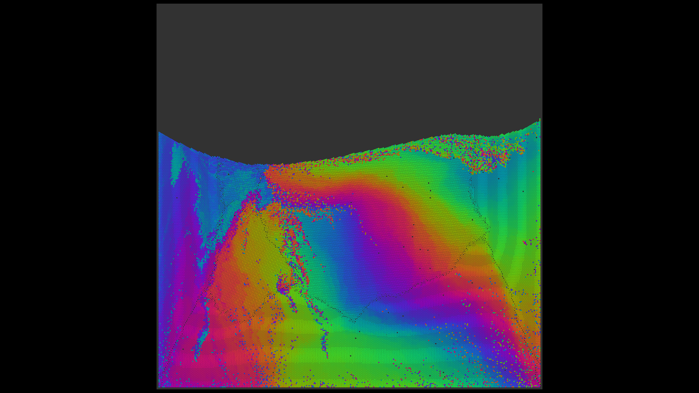

# SFML Multithread Verlet



Demonstrating a **multithreaded particle simulation** using the **Verlet integration** method for calculating particle motion, with optimized **collision detection** and interaction. It leverages **SFML** for rendering and handling the GUI.

## Key Features
- **Multithreading**
- **Verlet Integration**
- **Optimized Collision Detection**: The simulation manages large numbers of particles efficiently, using techniques like **collision grids**.
- **SFML (Simple and Fast Multimedia Library)**: The graphical frontend uses SFML for window management, rendering, and input handling.

## How It works

The core of the simulation uses `Verlet integration`, a numerical method to compute the positions of particles over time based on forces acting upon them. Unlike traditional `Euler integration`, `Verlet` provides better stability for `physics simulations`, particularly for systems involving constraints and collisions.

**Collision detection** is optimized using a `spatial grid`, which helps efficiently identify which particles are close to each other and may collide. This method reduces the number of checks needed for collisions in large particle systems.

The simulation also implements `multithreading` using a custom thread pool, which distributes `physics calculations` across multiple cores, improving performance when simulating a large number of particles.

## Simulation Structure

```bash
src/
├── engine/
│   ├── common/
│   │   ├── color_utils.hpp           # Utilities for handling colors
│   │   ├── event_manager.hpp         # Manages SFML events
│   │   ├── grid.hpp                  # Grid data structure for efficient spatial partitioning
│   │   ├── index_vector.hpp          # Helper for indexing vectors
│   │   ├── math.hpp                  # Common math utilities
│   │   ├── number_generator.hpp      # Random number generation utilities
│   │   ├── racc.hpp                  # A physics-related helper
│   │   ├── utils.hpp                 # General utilities used throughout the simulation
│   │   ├── vec.hpp                   # Vector operations
│   ├── render/
│   │   ├── viewport_handler.hpp      # Handles viewport transformations and settings
│   ├── window_context_handler.hpp    # Manages the main SFML window and its properties
├── physics/
│   ├── collision_grid.hpp            # Optimized structure for detecting particle collisions
│   ├── physic_object.hpp             # Defines individual physics objects (particles)
│   ├── physics.hpp                   # Physics engine that handles object interactions and Verlet integration
├── renderer/
│   ├── renderer.cpp                  # Responsible for rendering objects using SFML
│   ├── renderer.hpp                  # Renderer class declaration
├── thread_pool/
│   ├── thread_pool.hpp               # Thread pool implementation for handling multithreaded physics updates
├── main.cpp                          # Main entry point of the application
```
## Key Components
<details>
<summary>Show/Hide</summary>

   ### Engine:
   - **Common**: This module contains general-purpose utilities like math functions, color utilities, event managers, and random number generation.
   - **Render**: Manages the rendering context (SFML viewport and window) and handles drawing objects on the screen.
   - **Physics**: This is the core of the physics simulation, handling collision detection using a grid structure and implementing Verlet integration for particle motion.
   - **Renderer**: Manages how particles and other objects are rendered to the screen.
   - **Thread Pool**: Manages the execution of tasks across multiple threads, improving the performance of physics calculations.

   ### Main Entry Point:
   - **main.cpp**: Initializes the simulation, sets up the SFML window, and starts the main loop, which updates physics and renders the particles on screen.

</details>

## Compilation

[SFML](https://www.sfml-dev.org/) and [CMake](https://cmake.org/) need to be installed.

Create a `build` directory

```bash
mkdir build
cd build
```

**Configure** and **build** the project

```bash
cmake ..
cmake --build .
```

On **Windows** it will build in **debug** by default. To build in release you need to use this command

```bash
cmake --build . --config Release
```

You will also need to add the `res` directory and the SFML dlls in the Release or Debug directory for the executable to run.
